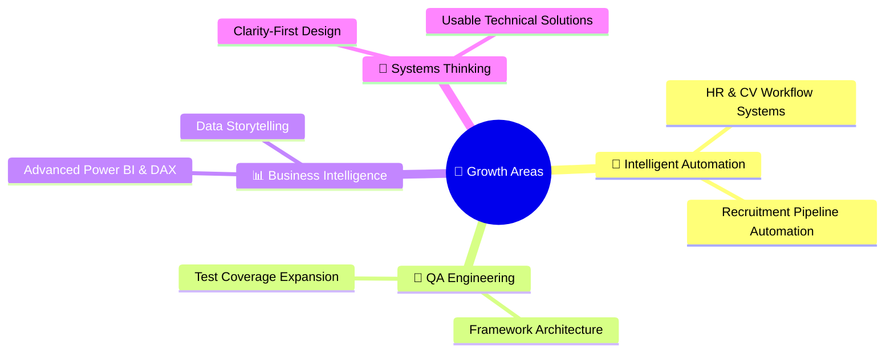

<!-- HEADER -->

 

 

🔹 **Data Analyst** • 🔹 **QA Automation Engineer** • 🔹 **Intelligent Systems Builder**

*Transforming raw data into clarity, and manual workflows into reliable systems.*

 

&nbsp;

&nbsp;

 

 

 

## 💎 &nbsp; About Me

<table>
<tr>
<td>

 

I'm a software engineer based in **Johannesburg, South Africa**, working at the intersection of data analytics, QA automation, and intelligent systems.

🔸 &nbsp; I build **SQL + Power BI reporting** that helps teams make faster, better business decisions

🔸 &nbsp; I test **workflows and data integrity** with both manual and automated checks

🔸 &nbsp; I track and prioritize defects in **Jira** and **QMetry** to keep quality visible

🔸 &nbsp; I design **automation frameworks** and **dashboard solutions** built for long-term trust

What drives me is simple — I want the systems I build to be clear enough that people actually trust them. Not just technically sound, but genuinely usable and genuinely reliable.

I'm still growing into the engineer I want to become. But the work is intentional: structured thinking, clean execution, and output that holds up when someone looks closely.

> *"If they can't understand it, they won't trust it."*

🔗 **Portfolio:** [mnqobeey.netlify.app](https://mnqobeey.netlify.app/) — *Explore my complete project showcase*

 

</td>
</tr>
</table>

 

 

## 🗂️ &nbsp; Featured Projects

 

<table>
<tr>
<td align="center" width="50%">

### 🎓 &nbsp; NexusEd

**Student Feedback System**

*From requirements to dashboard-ready insights*

 

Captured stakeholder needs and business goals.
Designed architecture and database structure.
Built dashboards to visualize feedback trends.

 

`ASP.NET` &nbsp; `SQL` &nbsp; `Dashboards`

 

[View Project →](https://github.com/Mnqobeey)

</td>
<td align="center" width="50%">

### 🛒 &nbsp; Takealot Web Automation

**End-to-End UI Test Automation**

*Automated core user journeys at scale*

 

Automated search, browse, and cart flows.
Reduced flaky runs with stable waits and reusable patterns.
Improved debugging with logs and screenshots.

 

`Selenium WebDriver` &nbsp; `Java` &nbsp; `IntelliJ IDEA`

 

[View Project →](https://github.com/Mnqobeey/Automation)

</td>
</tr>
<tr>
<td align="center" width="50%">

### 🌐 &nbsp; Portfolio Website

**Personal Brand & Showcase**

*A clean digital presence — who I am, what I've built*

 

Responsive layout with clear content hierarchy.
Projects and certifications in one place.
Designed to feel premium without unnecessary noise.

 

`HTML5` &nbsp; `CSS3` &nbsp; `JavaScript`

 

[View Live →](https://mnqobeey.netlify.app/)

</td>
<td align="center" width="50%">

### 📊 &nbsp; Data & Analytics Projects

**SQL · Python · Power BI**

*Structured analytics from raw data to decisions*

 

Query engineering and data cleaning pipelines.
Reporting solutions built for clarity.
Focus on actionable, well-structured outputs.

 

`SQL` &nbsp; `Python` &nbsp; `Power BI` &nbsp; `Excel`

 

[View Projects →](https://github.com/Mnqobeey)

</td>
</tr>
</table>

 

 

## 🛠️ &nbsp; Technical Arsenal

 

### 📊 &nbsp; Data & Analytics Platforms

 

  

### 🧪 &nbsp; Automation & QA

 

  

### 💻 &nbsp; Programming Languages

 

  

### 🌐 &nbsp; Development & Design

 

  

### ⚙️ &nbsp; Tools & Platforms

 

  

### 🧠 &nbsp; Foundations

 

 

 

## 🎯 &nbsp; Current Focus Areas

 

 

 

## 📈 &nbsp; GitHub Stats

 

&nbsp;&nbsp;

  

 

 

## 📜 &nbsp; Certifications

 

| | Certification | Status |
|:---:|:---|:---:|
|  | **Microsoft Azure Fundamentals** |  |
|  | **Power BI Data Analytics** |  |
|  | **Software Testing / QA Fundamentals** |  |

 

 

> 💡 *"The best systems aren't just functional — they're understood."*

 

🚀 **Ready to collaborate?** Let's turn insights into action with data-driven intelligence!

🔗 **Get in touch:** &nbsp; [Portfolio](https://mnqobeey.netlify.app/) &nbsp;•&nbsp; [Email](mailto:YOUR_EMAIL) &nbsp;•&nbsp; [LinkedIn](https://linkedin.com/in/YOUR_LINKEDIN)

 

&nbsp;

 

